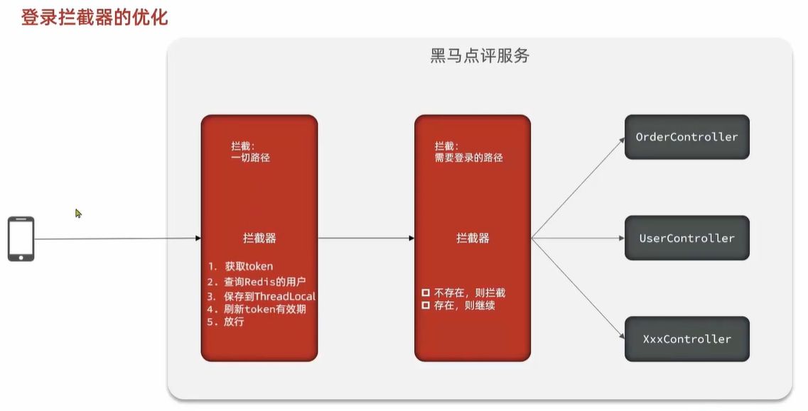
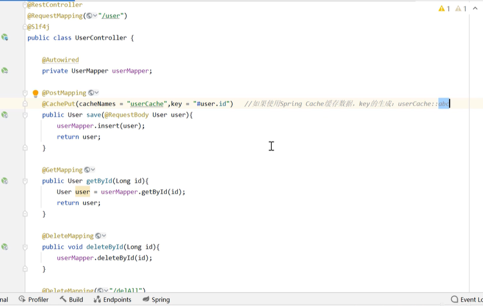

git add添加到管理  红变绿
commit到本地 绿变白
修改 白变蓝
push到远程
 
# TODO
* 首页查询所有文章时判断当前用户是否点赞 √/
* 文章详情判断是否点赞 √/
* 收藏、点赞文章有关联表 √/
* 我的收藏、我的点赞 √/  [ 从redis的zset查询我的收藏关注文章，并修改用户-收藏、用户-点赞表；或者从用户-收藏、用户-点赞表查询]
* 查询文章收藏点赞前10篇，降序 √/
* 我的文章总收藏量√/
* 我的文章数量√/
* 用户关注、取消关注 、我关注的、我的粉丝列表、其他用户info √/
* 数据库连接池 √/
* 权限校验√/
  * 拦截器中未开放的接口，需要登录才能访问
  * 对于需要管理才能访问的接口，首先肯定不予开放，其次要添加@AuthCheck注解，检查登录用户的权限

* http消息转换器
* CommandLineRunner
* 网关检测 文章viewNum
* 共同关注
* out_link表、events表、ip_request_info表
* 违规禁词检检测
* ES+Doris  https://www.selectdb.com/blog/1037
* 用户签到   bitmap+nextSetBit  前端设置缓存避免多次签到请求 localStorge
* 事务细粒度，分批处理避免长事务。、参考hmdp的消息队列，鱼皮的智能刷题平台QuestionBankQuestionServiceImpl
* 重试机制，guava retrying库

 登录态保存到本地线程而不是session
根据uid生成token返回给前端，前端每次请求头带上token。
token保存到redis，拦截器校验token，通过则从redis取出token，若取不出说明token已经过时要重新登录
* token有效期和redis有效期不同
* 用户登陆后长时间不操作，authorization的token失效，那么redis到期也自动删除，拦截器仅检验token是否失效不用查redis
* 登陆后一直操作，redis要刷新，但是token不刷新

* 未登录 -> 登录 ->vo 存到redis，并保存到本地线程。下次访问，刷新redis的token有效期
* value=token
* 管理可在每个类别下面创建标签，类别和标签列表展示在前端创作台
* 一篇文章必须有category，可以没有pTags，pTags最多5个
* passage表  categoryID  pTags(json数组)
* category表 cTags(json数组) 不需要category-tag
* 用户创作时，为文章选定cTags，cTags内容直接作为pTags
* mysql向es迁移文章时只迁移审核通过且没有删除的文章，增量同步、全量同步！！！
* 用户可以根据文章ptags搜索文章

# 前端
* ant design pro 现成的后台管理系统
* proComponents 高度封装的组件库
* ant design

# 后端
* 数据库连接池
* 文章标签tags用json数组     

# 登录拦截及权限校验
* 前端路由不展示的界面后端还有必要做权限校验吗?
* 客户端可以被绕过：前端路由的限制可以很容易被绕过。用户可以通过**直接访问URL** 或使用工具（如 Postman）绕过前端界面，从而尝试直接请求受保护的资源或接口。如果后端没有做权限校验，恶意用户可以未授权地访问这些资源。
* 保护后端资源：即使前端不展示某些界面，后端资源（例如 API 接口、数据库记录等）仍然需要保护，**以防止未授权访问或数据泄露**。

* 登录拦截器设置拦截路径，拦截需要登陆的路径，2种情况
  * 1：不需要登陆，放行
  * 2：需要登陆，登录后放行
例：未登录用户放行后，要收藏某篇文章，此时路径就是需要登陆才可以访问的
* AOP切面+注解检查身份（使用在类和方法上，核验身份）
  * 如果是放行的未登录用户，则无权进行某些操作，需要登陆
  * 如果是放行的已登录用户，检查身份来决定能否进行某些操作

类名和标签名都有字数限制 10

管理员审核开关，可以开启文章审核或者关闭审核
苍穹外卖P31 自动字段填充用户名，减少冗余代码
苍穹外卖P93  spring cache   Spring EL语法->  #开头：#user.id

# 需求分析
* 登陆注册 p0
* 用户模块
  * 增删改查：p0 管理员可以禁用用户、删除用户、添加用户

* 文章模块
  * 查看文章 p0
  * 发布文章 p0
  * 删除文章：p0 普通用户只能删除自己的文章，管理员可以删除任意文章。通过控制层接口区分，管理员可以拿到所有文章，而用户只能拿到自己的
  * 修改文章
  * 审核文章：仅管理
  * 评论文章
  * 点赞文章
  * 收藏文章

* 标签模块：分为文章标签和用户的兴趣标签
  * 添加标签：用户也可以添加
  * 删除标签：仅管理员

* 类别模块：文章必须要有类别，可以没标签
  * 类别只能由管理员创建
  * 类别和文章是一对多，类别和标签是多对多，标签属于某个类别
  * 一个文章只能有一个类别，但可以有多个标签
  * 一个类别可以有多个文章
  * 一个类别可以有多个标签

* 管理页可视化统计，PV、UV

# 高级功能
* 文章草稿箱
* 签到等级功能 BitMap
* ES搜索 增量同步
* 查看留言私信功能
* 关注推送
* Feed流大数据推送
* 文章定时发布
* AI生成文章摘要summary
* 公告功能
* 用户查看收藏

# 系统设计
## 表设计[最初，不是最新的]

# 功能设计
不管是后端返回给前端的数据还是全局异常处理器返回给前端的异常统一都是BaseResponse类型，这是返回基类
异常处理  ErrorCode  自定义异常BusinessException ->全局异常处理器GlobalExceptionHandler(全局异常处理器要返回给前端，返回BaseResponse类型)
返回前端  ResultUtils包 最终给前端返回的也是BaseResponse类型